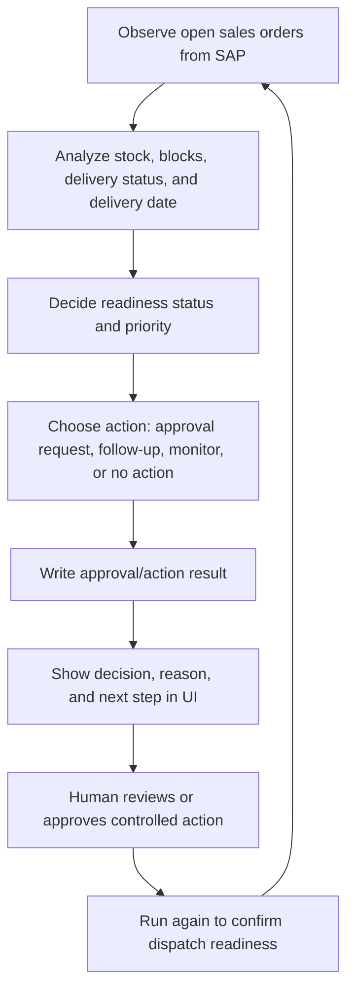

# Agent Flow

The agent follows a practical observe-analyze-decide-act-monitor pattern.

## Agentic Flow

## Decision Examples

| Situation | Agent Decision | Next Step |
|---|---|---|
| Confirmed stock and no blocks | Ready for delivery | Create approval request |
| Credit block | Blocked | Ask credit team to release block |
| Delivery block | Blocked | Resolve delivery block in sales order |
| Stock shortage | At risk | Follow up with supply planning |
| Existing delivery found | Already in delivery | Monitor PGI status |

## Action Modes

| Mode | Behavior |
|---|---|
| `APPROVAL_ONLY` | Agent creates approval/follow-up records but does not directly create delivery |
| `CONTROLLED_AUTONOMY` | Agent can execute controlled actions after required approvals are present |
