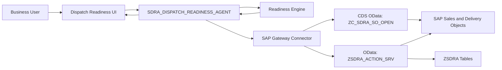

# Architecture

The SAP Dispatch Readiness Agentic AI is designed as a controlled action agent. It observes SAP sales order data, analyzes dispatch readiness, decides the next best action, and writes controlled approval or follow-up actions back to SAP.

## High-Level Architecture



## Main Components

| Component | Purpose |
|---|---|
| Dispatch Readiness UI | Business-friendly screen for SAP connection, dispatch run, search/filter, decisions, and next steps |
| `SDRA_DISPATCH_READINESS_AGENT` | Agent orchestration layer for observe, analyze, decide, act, and monitor |
| Readiness Engine | Classifies sales order lines as ready, blocked, at risk, partial stock, or already in delivery |
| SAP Gateway Connector | Calls SAP OData services and action endpoints |
| `ZC_SDRA_SO_OPEN` | CDS/OData source for open sales order lines |
| `ZSDRA_ACTION_SRV` | OData service for approval requests and controlled action logging |
| `ZSDRA_APPR_REQ` | Approval request persistence table |

## Controlled Autonomy

The default mode is approval-first. The agent can detect and prepare an action, but delivery creation remains controlled until approval is recorded.

```text
Default mode: APPROVAL_ONLY
Autonomous mode: CONTROLLED_AUTONOMY
```

This keeps the agent useful for dispatch planning while reducing risk in real SAP execution.
